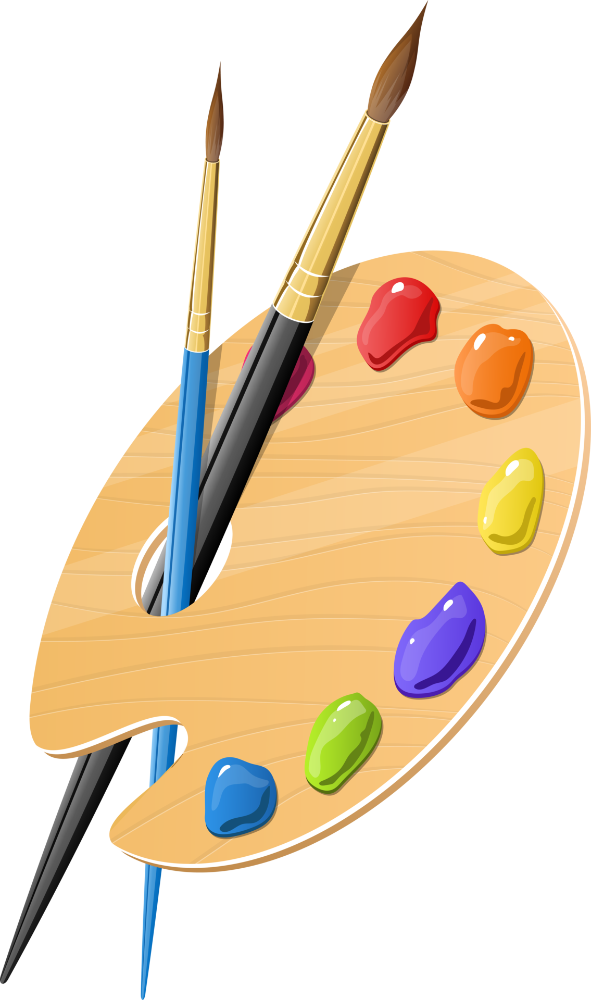

  
  

One thing that unites software engineering and art is their perpetual evolution. In both fields, embracing change and discovering inventive solutions are fundamental aspects of their creative and ever-changing nature.

## Commonalities
Similar to the ever-evolving canvas of art, software engineering is a voyage marked by continuous growth and adaptability. Just as artists navigate the dynamic world of art, software engineers also navigate the evolving technological landscape. Both domains demand perseverance, a thirst for knowledge, and an unwavering commitment to advancement. In this essay, I will delve into my passion for software engineering and explore the skills I aspire to cultivate within this field.

## Passion
My interests in software engineering stem from a strong desire to express myself creatively. I've always enjoyed expressing my ideas through art forms such as video editing and artistic design. What interests me in software engineering is the possibility to combine my artistic abilities with technical abilities. I consider software engineering as a blank canvas on which to paint with code, creating solutions to challenging problems while adding a bit of creativity. Whether it's creating user interfaces that are not only functional but also visually appealing, or developing new applications that push the boundaries of user experience, I'm excited to use my creative abilities to elevate software engineering to the level of an art form. 

## Growth
In the future, I aspire to bridge the gap between my creative instincts and software engineering expertise. I'm determined to master advanced design principles and UX concepts while delving deeper into front-end development. I see myself collaborating with diverse teams to apply my creative insights to a variety of projects. Ultimately, I aim to be a software engineer who merges technical prowess with artistic sensibilities, making a lasting impact in this ever-evolving landscape.

