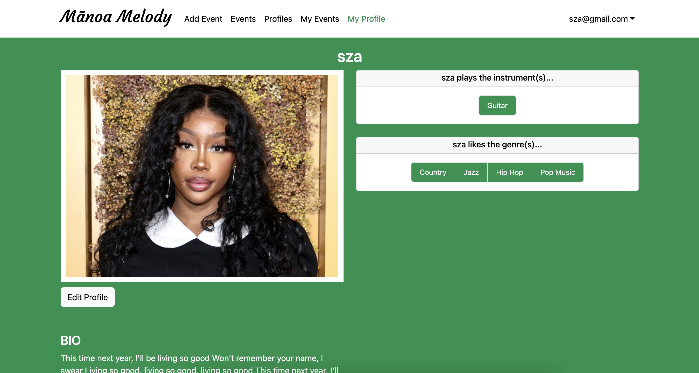
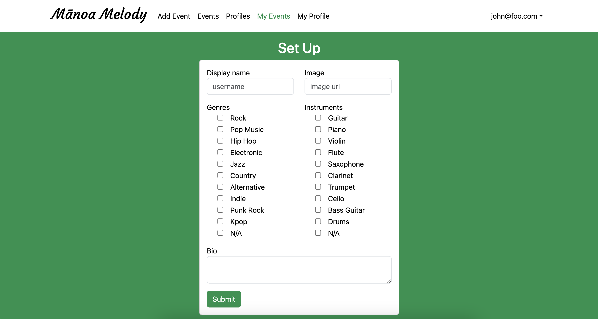

Manoa Melody is an app designed for University of Hawaii at Manoa musicians and musicians alike. Its main goal is to use music to bring this niche group together. Users have the option to share the music genres they like to listen to and instruments they play. They can also upload musical performances or other events to the platform. This application was created by Shedrick Klifford Ulibas (me), Harvey Dayne Lafradez, Kristine Orpilla, Destiny Shishido, Sierra Morales

# Contributions

### My Profile Page

I worked on different parts of the application with my team. I concentrated on the user profile and the page featuring the user events. Completing these pages has been a great way for me to learn about responsiveness and reactivity throughout the application. I also concentrated on the setup form, which the information for the user profile page comes from. I managed to display the user image without causing any strange image distortion. Additionally, I discovered a way to have the user's own events to appear on the profile page, updated each time the user adds a new event.

### Profile Protection

It is also important to note that I worked on the various web pages' protection. The protection involved determining whether the person who is currently logged in has a profile set up. I made it such that the user must already have a profile in order to access the various web pages. This required me to write a function that restricts the user from creating multiple profiles under the same account in addition to checking if the user is logged in and has a profile associated with it. In the screenshot above, you can see that the user clicked on the 'My Events' navbar item, but was prompted the Set Up form for the profile.

### Links

    <a target="_blank" href="https://manoa-melody.site//">Manoa Melody</a>

    <a target="_blank" href="https://manoa-melody.github.io/">Home Page of Manoa Melody</a>

    <a target="_blank" href="https://github.com/manoa-melody">Github Organization for Manoa Melody</a>

