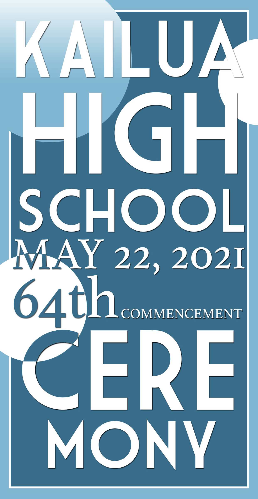

This project was to design a graduation commencement brochure cover. Utilizing my Photoshop skills, I focused on simplicity while maintaining visual appeal.  This project helped me refine my ability to craft a striking and straightforward visual statement for our graduating class.

I strategically used minimalist typography in the graduation commencement brochure cover design to achieve the desired simplicity and appeal. Minimalist typography is frequently used in design to convey professionalism while also allowing the content to shine through without distraction. The message remained clear and elegant due to the careful selection of clean, easily readable fonts. The use of simple typography not only effectively conveyed the necessary information but also contributed to the overall aesthetic, resulting in a balanced and visually pleasing composition.

In selecting the color palette for the project, I deliberately chose shades of blue to align with our school's colors, fostering a strong sense of identity to our institution. By utilizing various shades of blue, ranging from navy to sky blue, I aimed to create a visually pleasing composition. The incorporation of white into the palette played a pivotal role in achieving the desired minimalistic look, ensuring that the design remained clean and uncluttered. This combination of blues and white not only paid homage to our school but also evoked a sense of professionalism, simplicity, and elegance.

